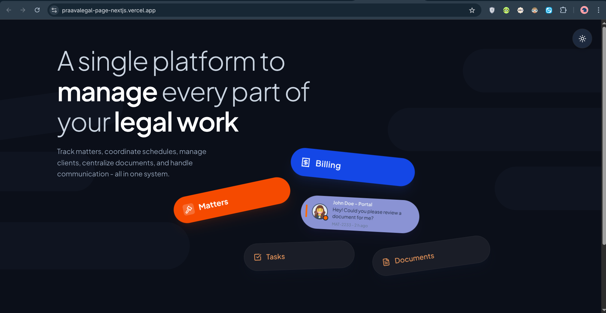
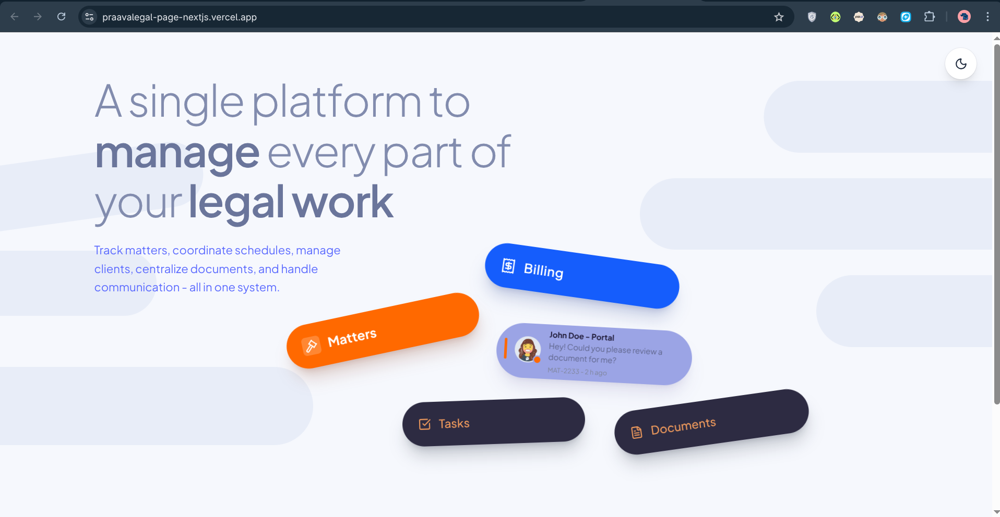

Assignment: The Floating Hero Section

A pixel-perfect replication of the "Legal Work Platform" hero section, emphasizing high-fidelity CSS layout, component reusability, and interactive visual polish.

🚀 Technical Implementation
1. Component Architecture
FloatingCard Component: A flexible, prop-driven component handling dynamic rotations, multiple color variants, and distinct layout slots.

Specialized Variant: The "John Doe - Portal" card is implemented as a unique layout variant within the same architecture to demonstrate advanced slot handling.

2. Layout & CSS Mastery
Perspective & Rotation: Used Tailwind arbitrary values and Framer Motion to achieve the "chaotic but organized" 3D aesthetic.

Responsive Design: A grid-based split layout that transitions from a side-by-side desktop view to a mobile-friendly stacked configuration.

Background Blobs: Implemented using absolute-positioned animated pills with backdrop-blur and varying opacities to match the design assets.

3. Visual Polish & Bonus Features (⭐)
🌙 Dark Mode Support: Fully integrated using next-themes and Tailwind v4, featuring unified CSS variables for seamless theme switching.

⚡ Framer Motion Animations:

Entrance: Cards slide and rotate into position with physics-based spring transitions.

Hover: Subtle scale and counter-rotation effects for an interactive feel.

Background: Continuous floating motion for background decorative elements.

🛠️ Tech Stack
Framework: Next.js(App Router)

Styling: Tailwind CSS

Animations: Framer Motion

Icons: Lucide React
